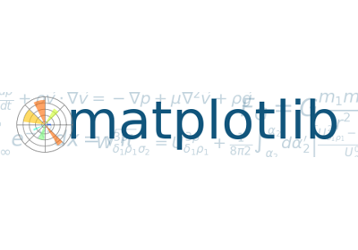

<H1>Mini Projet "Analyzing-Netflix-Data"<H1>
 

## Présentation 
Ceci est un prototype de projet en analyse de donnée
## Bibliothéque 
On a utilisé les bibliothèques :
* Pandas : est un outil d'analyse et de manipulation de données open source rapide, puissant, flexible et facile à utiliser
   

* Numpy : fournit une interface efficace pour stocker et exploiter des tampons de données denses.
 

* Matplotlib , Os et Seaborn : permet de créer des graphiques et de leur donner du style.
  

## :file_folder: Présentation du dataset
    
  Netflix est un service par abonnement où les utilisateurs peuvent voir des films et des émissions de télévision sans publicités. Permet également de télécharger le contenu sur un appareil IOS, Android ou Windows et de le regarder sans connexion à Internet. Nous pouvons maintenant commencer à analyser les données.

  </h1>

